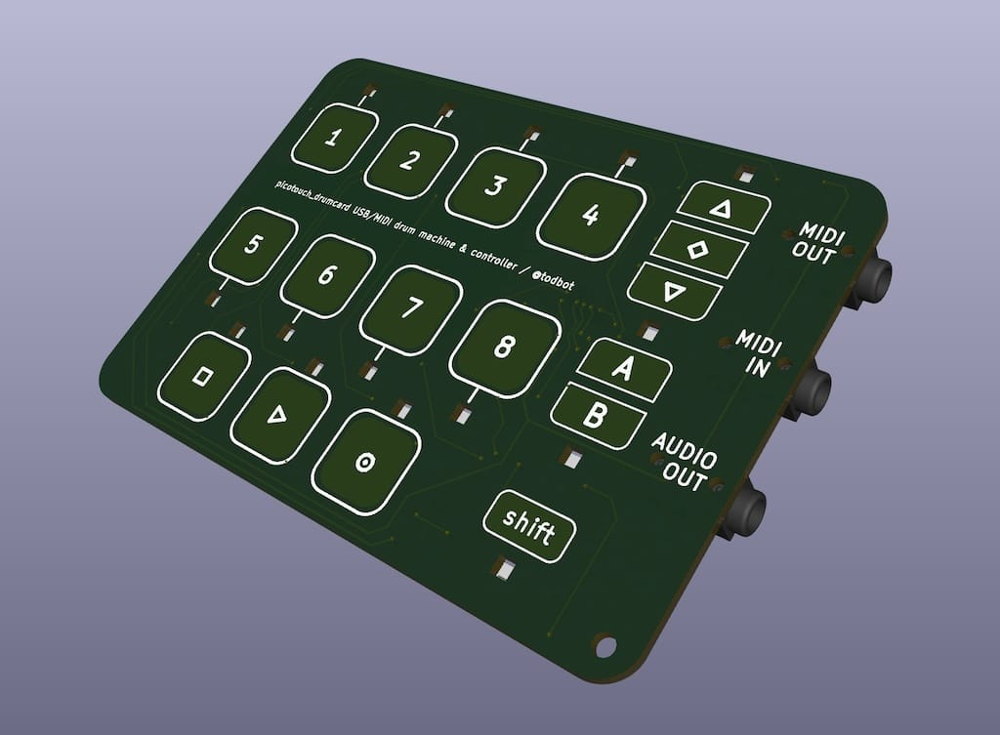

# picotouch_drumcard

Playing card-sized (2.5"x3.5") sequencer / synth / USB / MIDI touch controller

Successor to the [picotouch_bizcard MIDI controller](https://github.com/todbot/picotouch_bizcard)

## Features

* 17 capacitive touch pads arranged in a step-sequencer layout
* 15 reverse-mounted LEDs as status / touch indicators
* TRS-A MIDI In and Out
* Audio out (via 12-bit PWM)
* Battery powered, with lipo battery charging circuit
* Powered by Raspberry Pi Pico board
* Programmable with CircuitPython, Arduino, etc.

# Example code

* Drum sequencer + synth
* MIDI controller
* Macropad
* USB-MIDI interface

# 

https://github.com/user-attachments/assets/234cb804-bad1-4454-a92b-b1dc36a663cc
